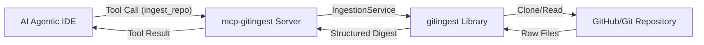

# GitIngest MCP Server

*An MCP gateway that turns any Git repository into an AI-ready digest.*

---

## 🏛️ Architectural Vibe

This codebase carries a **quiet, focused energy**. It is small, deliberate, and respects its boundaries.

```
vibe score: 85/100
modules: 4 (145 LOC)
coupling: minimal (server → service → gitingest lib)
ghosts: none
```

### The Modules

| Module | Lines | Role | Stability |
|--------|-------|------|-----------|
| `ingest_server/server.py` | ~45 | MCP server, tool registration | I = 0.2 (stable) |
| `ingest_server/services/ingestion_service.py` | ~50 | Business logic, ingestion | I = 0.3 (stable) |
| `ingest_server/models/ingestion.py` | ~9 | Pydantic schemas | I = 0.0 (stable) |
| `tests/test_server.py` | ~34 | Server tests | I = 1.0 (leaf) |
| `tests/test_service.py` | ~38 | Service tests | I = 1.0 (leaf) |

There are no god modules. No circular dependencies. No architectural hauntings.

### Energy Flow

```
tests.test_server ──┐
                    ▼
        ingest_server.server (transport)
                    │
                    ▼
        IngestionService (business logic)
                    │
                    ▼
            gitingest library (core)
```

`ingest_server.server` is a **stable transport layer** — it handles MCP protocol and delegates to the service.

`IngestionService` is a **business logic layer** — it orchestrates ingestion, handles formatting, and manages defaults.

`ingest_server.models` contains **data schemas** — Pydantic models for structured requests.

---

## 📡 What This Does

`mcp-gitingest` is a specialized Model Context Protocol (MCP) server that wraps the `gitingest` library. It lets AI agents and LLMs fetch, clean, and format entire codebases into structured text with a single tool call.

Instead of juggling git commands and file parsing, an agent simply says: *"Ingest this repository"* — and receives a prompt-ready digest: summary, tree, and content.

---

## ✨ Features

- **Prompt-Ready Digests** — structured output designed for LLM context
- **Selective Ingestion** — glob patterns to include/exclude files
- **Branch Support** — target any branch or tag
- **Token Efficiency** — summary includes token estimates
- **Configurable Limits** — default max file size configurable via service

---

## 🤖 AI Agent Guide

For detailed agent interaction patterns, see **[AGENT.md](./AGENT.md)**.

---

## 🔧 The Tool: `ingest_repo`

The sole exposure point of this server.

**Parameters:**

| Name | Type | Description |
|------|------|-------------|
| `url` | `string` | **Required**. GitHub/Git repository URL. |
| `branch` | `string` | Optional. Branch to analyze. |
| `include_patterns` | `list[string]` | Optional. Glob patterns to include (e.g. `["*.py", "*.md"]`). |
| `exclude_patterns` | `list[string]` | Optional. Glob patterns to exclude. |
| `max_size` | `number` | Optional. Max file size in bytes (default: 10MB). |

---

## 🧱 Architecture

Built with **FastMCP** (Python) for robust MCP communication.



**Layers:**
1. **Transport:** FastMCP (MCP protocol)
2. **Server:** `ingest_server/server.py` (tool registration)
3. **Service:** `ingest_server/services/ingestion_service.py` (business logic)
4. **Core:** `gitingest` library (ingestion logic)
5. **Source:** Git repository (input)

---

## 📦 Packaging

This project is structured as a Python package with `hatchling` build backend.

```toml
[project]
name = "mcp-gitingest"
version = "0.1.0"
dependencies = ["fastmcp>=3.0.2", "gitingest>=0.3.1"]

[project.scripts]
mcp-gitingest = "ingest_server.server:main"
```

Entry point: `mcp-gitingest` runs the server directly.

---

## 🚀 Installation & Setup

### Prerequisites

- [uv](https://github.com/astral-sh/uv) installed

### From Source

```bash
cd mcp-gitingest
uv sync
```

Run the server:

```bash
uv run python -m ingest_server.server
```

Or use the installed entry point (after `uv pip install -e .`):

```bash
mcp-gitingest
```

### Wheel Install

```bash
pip install dist/mcp_gitingest-0.1.0-py3-none-any.whl
mcp-gitingest
```

### With uvx (recommended)

```bash
uvx mcp-gitingest
```

---

## 🖥️ IDE Integration

Add to your MCP configuration (Claude Desktop, Cursor, etc.):

```json
{
  "mcpServers": {
    "gitingest": {
      "command": "uvx",
      "args": ["mcp-gitingest"]
    }
  }
}
```

Or with local development (from source):

```json
{
  "mcpServers": {
    "gitingest": {
      "command": "uv",
      "args": [
        "--directory",
        "/path/to/mcp-gitingest",
        "run",
        "python",
        "-m",
        "ingest_server.server"
      ]
    }
  }
}
```

Restart your IDE. The `ingest_repo` tool will appear.

---

## 🛠️ Development

### Run in dev mode

```bash
uv run python -m ingest_server.server
```

### Test with MCP Inspector

```bash
npx @modelcontextprotocol/inspector uv run python -m ingest_server.server
```

### Run unit tests

```bash
uv run pytest tests/
```

---

## 🔮 Architectural Notes

The codebase follows a **layered service architecture**:

```
ingest_server/
├── __init__.py
├── server.py          # FastMCP setup, tool registration
├── models/
│   ├── __init__.py
│   └── ingestion.py    # Pydantic schemas
└── services/
    ├── __init__.py
    └── ingestion_service.py  # Business logic
```

**Design decisions:**
- Service layer isolates business logic from MCP transport
- Pydantic models for request validation (extensible)
- Configurable defaults via service constructor
- Proper error re-raising for caller handling

---

## 📊 Health Metrics

| Metric | Current | Target |
|--------|---------|--------|
| Vibe Score | 85/100 | >80 |
| Coupling | Minimal | Minimal |
| Test Coverage | 100% | >90% |
| Cyclomatic Complexity | ~4 | <10 |
| Lines per Function | ~25 | <50 |

All green. No action required.

---

## 📄 License

MIT License — see LICENSE file.

---

*Maintained with ghostclaw awareness.*
