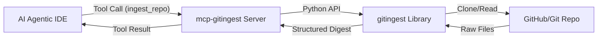

# GitIngest MCP Server

Turn any Git repository into a prompt-ready text digest for AI Agents.

## Overview

`mcp-gitingest` is a specialized Model Context Protocol (MCP) server that integrates the powerful `gitingest` library. It allows AI agents and Large Language Models (LLMs) to programmatically fetch, clean, and format entire source code projects into structured context.

## Features

- **Prompt-Ready Digests**: Replaces complex git operations with a single tool call that returns a structured plain-text digest.
- **Selective Ingestion**: Use glob patterns to include or exclude specific files (e.g., focus on `.py` files, ignore `node_modules`).
- **Branch Support**: Ingest code from any specific branch.
- **Token Efficiency**: Returns a summary with token estimates, directory tree, and delimited file contents.

## AI Agent Integration

For a dedicated guide on interacting with this server, see [AGENT.md](./AGENT.md).

## Architecture

The server is built using the **FastMCP** framework (Python) for standard and reliable MCP communication.



## Tool Documentation

### `ingest_repo`

The primary tool for repo ingestion.

**Parameters:**

| Name | Type | Description |
| --- | --- | --- |
| `url` | `string` | **Required**. The URL of the GitHub/Git repository. |
| `branch` | `string` | Optional. Specific branch to analyze. |
| `include_patterns` | `list[string]` | Optional. List of glob patterns to include (e.g. `["*.py", "*.md"]`). |
| `exclude_patterns` | `list[string]` | Optional. List of glob patterns to exclude. |
| `max_size` | `number` | Optional. Maximum file size in bytes (default: 10MB). |

## Installation & Setup

### Prerequisites

- [uv](https://github.com/astral-sh/uv) installed on your system.

#### Alternate: Install from Wheel

If you have the `.whl` file, you can install it directly:

```bash
pip install dist/mcp_gitingest-0.1.0-py3-none-any.whl
```

Then run it using the entry point:

```bash
mcp-gitingest
```

## IDE Integration

Add this server to your MCP configuration file (e.g., `claude_desktop_config.json` or Cursor settings):

```json
{
  "mcpServers": {
    "gitingest": {
      "command": "uv",
      "args": [
        "--directory",
        "/home/ev3lynx/Project/local-mcp-server/mcp-gitingest",
        "run",
        "python",
        "gitingest_server.py"
      ]
    }
  }
}
```

## Development

To run the server in development mode:

```bash
uv run python gitingest_server.py
```

To test the server using the MCP Inspector:

```bash
npx @modelcontextprotocol/inspector uv run python gitingest_server.py
```
